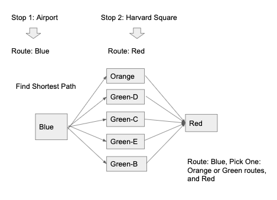

# Getting started
System requirements can be found in requirements.txt. 
* Run the following command to answer the three questions from the document:
`python main.py -s <startStop> -e <endStop>`
where, 
startStop and endStop are the stop ids from the "shape" data from the MBTA API.
* Retrieve a list of the stop ids by runnining the following:
`python info.py -s`
* Retrieve a dictionary between the routes utilized in solving for the shortest path by running the following command:
`python info.py -g`

# Data Gathering/Shaping
* Utilized the API endpoints and documentation made available by the MBTA: https://api-v3.mbta.com/docs/swagger/index.html
* Gathered the relevant route ids that were listed as type 0 and 1 (light and heavy rail). 
* Used the route ids to then gather the route/stop relationships from the "shape" dataset. 
* From the "shape" dataset, I created two dataframes. By having a dataset with the stop as a key and another as the route as a key, I was able to quickly query either for the stop or the route and get the associated information. 
1. Stop Id -> list of associated routes
2. Route Id -> list of associated stops

# Finding Required Routes between two stops
Optimization based on minimizing route swiching. If can get to destination by riding on two routes instead of three, then will select the two routes. Utilizing Dijkstra's algorithm to calculate the shortest path between routes. 

# Assumptions - Route Finding
1. Shuttle routes are not included. These include the Alewife-Harvard shuttle that is included in the "shape" api request that is associated with the redline during construction. 
2. Despite variations within a route, all stops are combined and associated with a route. For example, there are both Braintree-Alewife and Ashmont-Alewife trains on the red line routes. This solution associates all of those stops with the red route despite the Braintree/Ashmont variations. 
3. Optimization: For finding the route, optmization is based on the number of route switches instead of number of stops for the choosen route. I recognize that there are sceanrios where is may be significantly faster to switch routes additional times rather than ride further on a single route. 

# Improvements / Next Steps
Implement this algorithm on a stop level, instead of just on a route level. 

